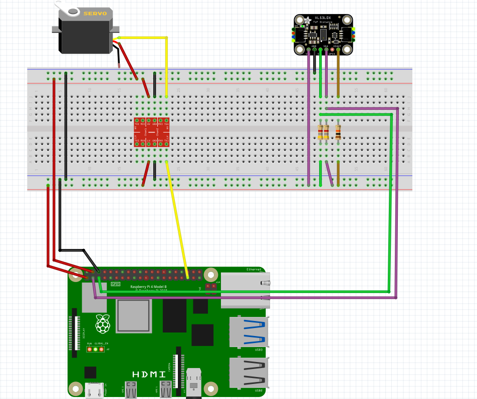
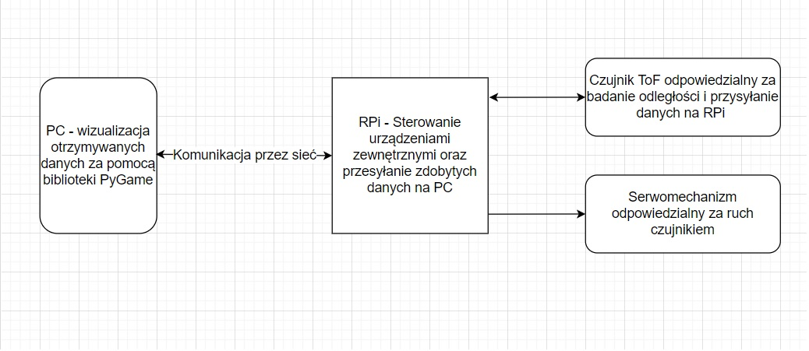
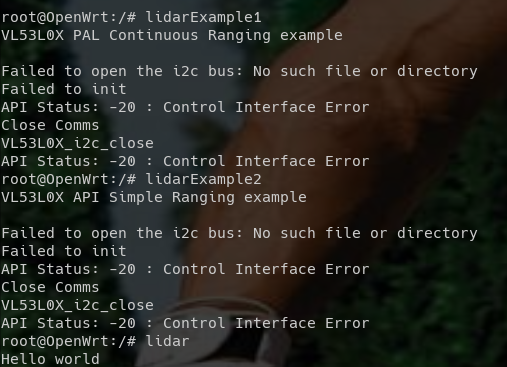
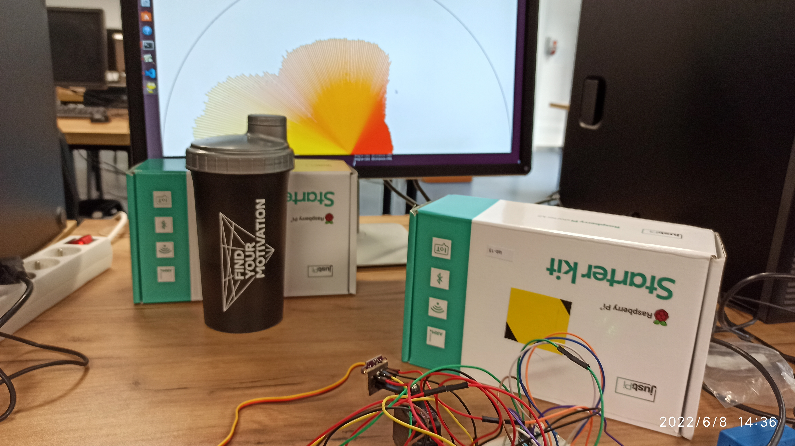
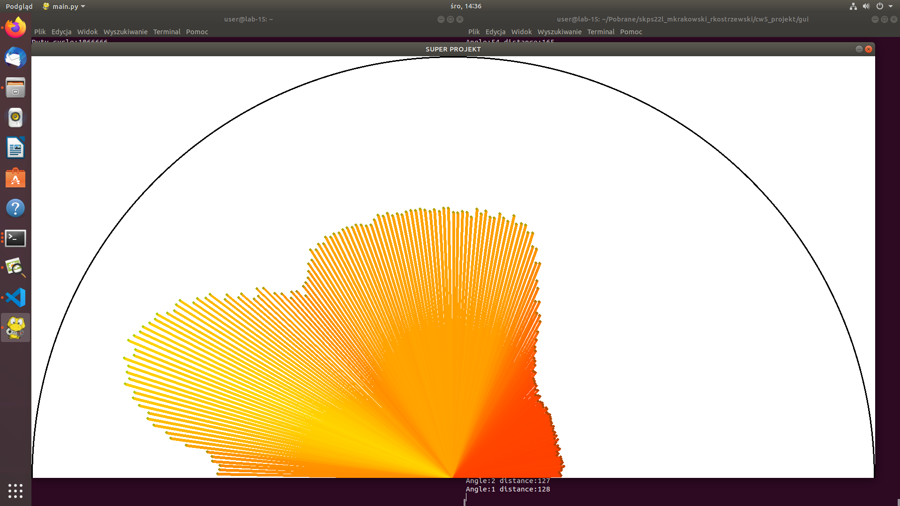

# SKPS projekt

## Temat - Lidar na bazie czujnika odległości ToF i serwomechanizmu

## Schemat podłączenia urządzenia

## Schemat struktury systemu

## Opis działania

Lidar będzie dokonywał pomiaru odległości w czasie rzeczywistym i podczas pomiaru będzie obracał serwomechanizm o niewielki kąt. Na podstawie tych danych będzie można zbudować mapę odległości.

## Szkielet paczki

Stworzyliśmy szkielet paczki który zawiera prostego maina, dwa przykłady użycia czujnika odległości oraz API i bibliotekę potrzebną do zaprogramowania czujnika. Jak widać same programy z przykładami włączają się na quemu, ale nie działają gdyż urządzenie nie jest podłączone.

## Zasada działania programu
### Serwer na RPi

Inicjalizowany jest sensor i serwomechanizm. Tworzony jest socket do komunikacji z hostem. Serwer czeka na sygnał od klienta o chęci otrzymania danych. Po otrzymaniu sygnału serwomechanizm przemieszcza się o niewielki kąt a czujnik czyta odległość. Dane te są wysyłane do klienta oraz wizualizowane.
### Wizualizacja po stronie PC:
Wykorzystane biblioteki w Python 3.9:
- PyGame
- socket

Stworzyliśmy program odbierający dane w postaci krotki (alfa, distance), gdzie alfa to obecny kąt nachylenia serwomechanizmu, a distance to odległość wykrywa przez radar. Wizualizuje on otrzymane dane z pomocą biblioteki PyGame.

### Jest możliwość zmiany parametrów programu w pliku /gui/include/constants.py takich jak:
- wielkość okna WIDTH HEIGHT: dla najlepszych efektów proponujemy przynajmniej 800x400
- MAX_LINE_LENGTH: Pozwala nam wskazać maksymalną odległość jaka ma być rysowana, maksymalnie wykorzystywany sprzęt mierzy na odległość 2000 mm, ale dla mniejszych odległości będzie warto zmniejszyć tą wartość, aby lepiej zauważyć różnice w badanej powierzchni.

# Prezentacja działania:

## Badany teren:

## Wykryty teren:

# Wnioski końcowe

Udało nam się!

